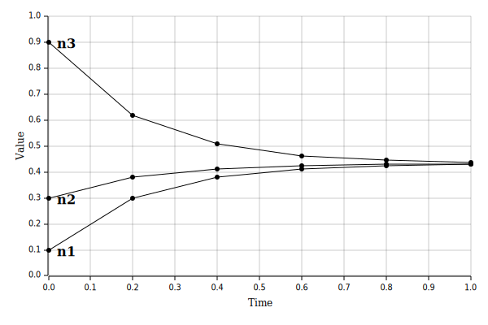

ndeq
===

Network diffusion simulator.

*The author of this crate is not good at English.*  
*Forgive me if the document is hard to read.*

## What is this?

This crate simulates diffusion on network.
Here, network nodes have value.
And, network edges have weight.
Then, diffusion averages node values through edge weights.

## Gallery

Full connected three nodes simulation.

## Target network

Main target of this crate is sparse networks.
In dense networks, crate can work but not efficient.
("sparse" and "dense" represent the number of edges in the network.)

Because this crate does not support parallel computing devices like GPUs.
(In dense networks, parallel computing after matrixing is very efficient.)

## Supported alogorithm

Simulation of diffusion is a type of initial value problem for differential
equations. On this problem, various numerical analysis approaches are known.
This crate has following alogorithms. 

* Euler methods - Very fast, but inaccurate.
* Runge-Kutta methods - Little slow, but accurate.

In addition, you can implement additional algorithms by yourself.
